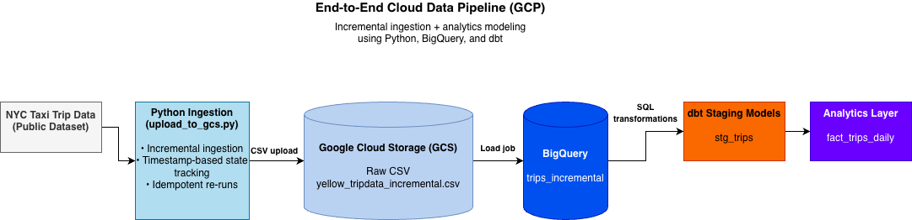

# End-to-End Cloud Data Pipeline (GCP)

This repository contains an end-to-end, incremental data pipeline built on Google Cloud Platform.

## Overview
NYC Taxi trip data is ingested using Python, stored in Google Cloud Storage, loaded into BigQuery,
and transformed into analytics-ready tables using dbt.

## Architecture

## Tech Stack
- Python
- Google Cloud Storage (GCS)
- BigQuery
- dbt
- SQL

## Data Flow
NYC Taxi Data → Python Ingestion → GCS → BigQuery → dbt → Analytics Tables

## Final Output
fact_trips_daily: Daily aggregated taxi trip metrics
